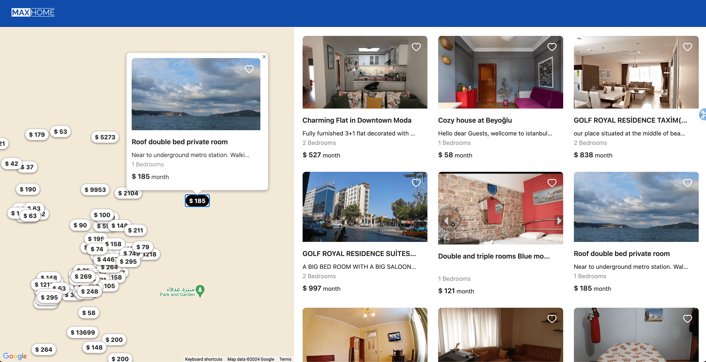
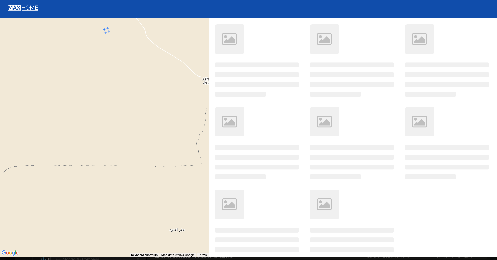
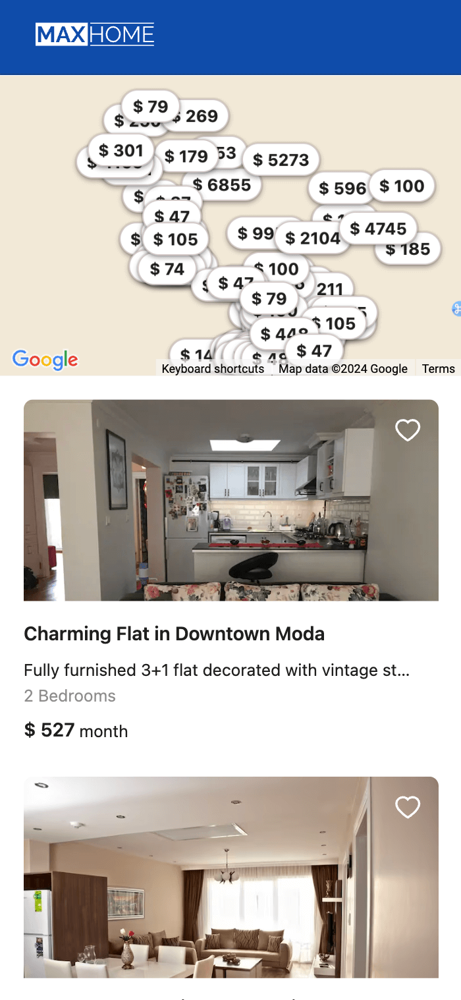

# Property search 

This demo project simply fetches the Property list from the backend based on Google Map bounds and shows the list of available properties in that region. Also it places markers on Map.


## Author

- [@ameer-khan](https://github.com/ameer-khan)


## Appendix

This project is built on Nodejs, MongoDb as a backend. Next js as a frontend framework. 

Cloud based MongoDb has been used from Atlas with pre loaded **Airbnb sample property data**.


<div align="center">
  <a href="" rel="noopener">
  </a>
</div>


## Demo

[Demo Video](https://www.awesomescreenshot.com/video/26342111?key=4c8c8327c2ff2f786891fcf7000f44b0)


## Screenshots








## Run Locally

Clone the project

```bash
  git clone git@github.com:ameer-khan/prop-search-demo.git
```

Go to the project directory

```bash
  cd prop-search
```

Update .env for credntials


```
1. go to /backend/.env -> Enable **DATABASE_URL**
2. got to /frontend/prop-search-frontend **NEXT_PUBLIC_MAP_KEY**

```

Install dependencies for the backend

```bash
  cd backend  
  npm install
```

Start the server

```bash
  npm run dev
  visit localhost:3000/listings
```


Install dependencies for the backend

```bash
  cd frontend
  cd prop-search-frontend  
  npm install
```

Start the server

```bash
  npm run dev
```

## Tech Stack

**This project runs on Node Version 18.17**

**Client:** Next js, Antd, Google maps

**Server:** Node, Express, Mongo DB, Mongoose


# Property search 

This demo project simply fetches the Property list from the backend based on Google Map bounds and shows the list of available properties in that region. Also it places markers on Map.


